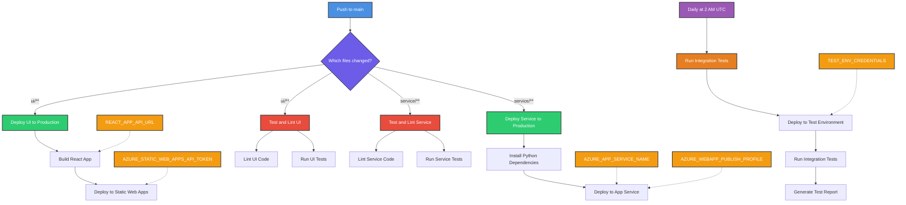
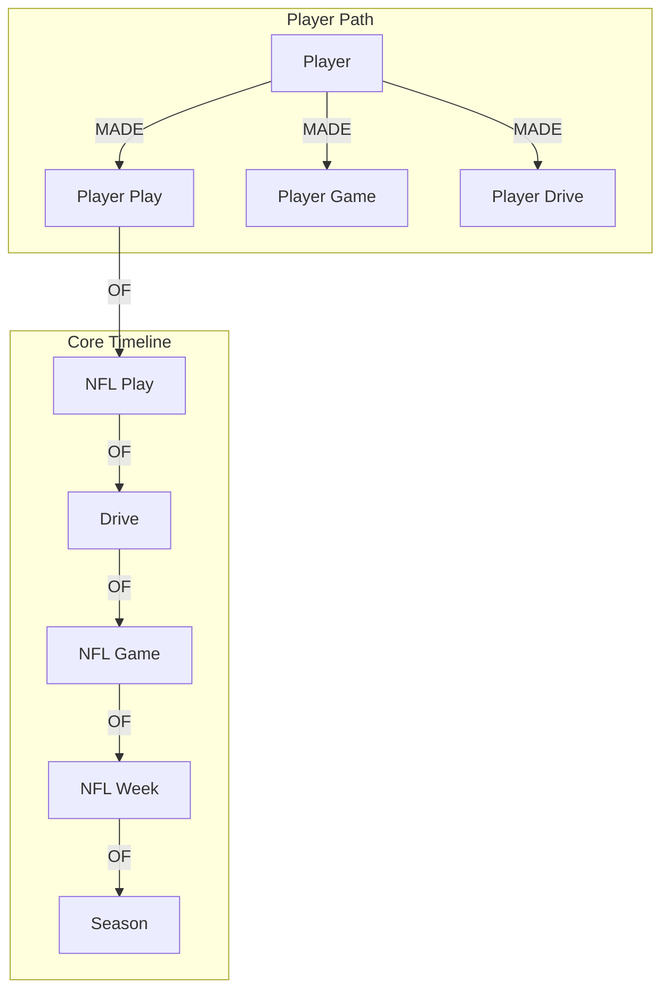

# StatFoundry

The quickest and simplest way to find any stat you can think of.

## Project Structure

```
StatFoundry/
├── service/           # FastAPI backend
│   ├── app/          # Application code
│   ├── tests/        # Backend tests
│   ├── requirements.txt
│   └── .python-version
├── ui/               # React frontend
│   ├── src/         # Source code
│   ├── tests/       # Frontend tests
│   └── package.json
├── docs/            # Documentation
│   └── assets/      # Documentation assets
└── .github/         # GitHub workflows
```

## Graph Architecture

The core graph schema is visualized in [docs/assets/graph_schema.mmd](docs/assets/graph_schema.mmd). The architecture lies across two axes:

### Temporal Axis: Plays to Seasons

`(Play)-[:OF]->(Drive)-[:OF]->(Game)-[:OF]->(Week)-[:OF]->(Season)`

### Organizational Axis: Players to Teams

`(Player)-[:MADE]->(PlayerPlay)-[:OF]->(Play)`
`(Team)-[:MADE]->(TeamPlay)-[:OF]->(Play)`

In certain places, these axes converge, creating a compound node. These are essentially lenses to view events from different perspectives.

`(Entity)-[:MADE]->(CompoundNode)-[:OF]->(TemporalNode)`

`(Player)-[:MADE]->(PlayerGame)-[:OF]->(Game)`

`(Team)-[:MADE]->(TeamGame)-[:OF]->(Game)`

etc...

### Relationships: There are 2 relationship types in this design

`MADE` is used when a Node creates a CompoundNode

`OF` represents a continuation along one of the defined axes. Essentiall aggregating up to the whole.

This pattern of scales nicely within the realm of American Football, as we can add college and USFL pretty easily with this pattern. We can also add things like coaches, coaching trees, officials, officiating crews, broadcasters. Think, maybe we can quantify the broadcaster's jinx, via analyzing `(BroadcastPlay)-[OF]->(NFLPlay)`

The pattern also seems to scale well outside of most organized sports, where teams are divided into divisions which make up leagues consisting of a collection games

## Design Considerations

While a graph database might seem like overkill for the current data model which follows fairly rigid hierarchical relationships, the choice was made with future extensibility in mind. The real power of the graph model will emerge as we add:

- Historical relationships (player transfers between teams, coaching changes)
- Complex interconnections (player-to-player interactions, teammate history)
- Multi-dimensional analysis (broadcast crews, weather conditions, stadium data)
- Cross-league relationships (college to NFL transitions, USFL/XFL crossovers)
- Social/influence networks (coaching trees, player mentorships)

These additions will create a rich web of relationships that would be challenging to model and query efficiently in a traditional relational database. The graph structure will allow us to:

1. Discover hidden patterns and relationships
2. Perform complex path-finding queries
3. Analyze network effects and influence
4. Scale horizontally as new relationship types are added

The initial investment in graph architecture positions us well for these future enhancements while maintaining a clean and intuitive data model for the current scope.

## Development Setup

### Prerequisites
- Node.js 16+ (for frontend)
- Python 3.11+ (for backend)
- Neo4j AuraDB instance

### Python Environment

```bash
# Install pyenv (if not already installed)
brew install pyenv

# Install Python version
pyenv install 3.11.0

# Create and activate virtual environment
cd service
pyenv local 3.11.0
python -m venv .venv
source .venv/bin/activate

# Install dependencies
pip install -r requirements.txt

# Set environment variables:
# ENVIRONMENT=development (for local dev)
# NEO4J_STATFOUNDRY_NFL_AURA_URI=your-neo4j-uri
# NEO4J_STATFOUNDRY_NFL_AURA_PASSWORD=your-password

# Start the backend
uvicorn src.app:app --reload
```

### Frontend Setup

```bash
cd ui
npm install
cp .env.example .env
# Configure environment variables in .env for local development
npm start
```

## Deployment

### Environment Configuration

#### Development
- **Frontend**: `http://localhost:3000` → `http://localhost:8000`
- **Backend**: CORS enabled for local development
- **Database**: Neo4j AuraDB
- **Environment Variables**: Uses `.env` files and local environment

#### Production
- **Frontend**: Azure Static Web Apps
- **Backend**: Azure App Service  
- **Database**: Neo4j AuraDB with production credentials
- **Security**: CORS disabled, environment-based configuration

### Automated Deployments

#### Frontend (Azure Static Web Apps)
- **Trigger**: Pushes to `main` branch with changes in `ui/` directory
- **Process**: Build React app with production environment → Deploy to Azure Static Web Apps
- **Configuration**: Uses `.env.production` for environment variables
- **Requirements**: 
  - `AZURE_STATIC_WEB_APPS_API_TOKEN` repository secret
  - Environment variables set in workflow (production service URL)

#### Backend (Azure App Service)
- **Trigger**: Pushes to `main` branch with changes in `service/` directory  
- **Process**: Build Python app → Deploy to Azure App Service
- **Configuration**: Environment variables set in Azure App Service
- **Requirements**:
  - Azure service principal secrets for authentication
  - Production environment variables in Azure App Service:
    ```
    ENVIRONMENT=production
    NEO4J_STATFOUNDRY_NFL_AURA_URI=your-neo4j-uri
    NEO4J_STATFOUNDRY_NFL_AURA_PASSWORD=your-password
    ```

### Security Features

- **Environment-based CORS**: Backend CORS middleware only enabled in development
- **Environment variable validation**: Backend validates required environment variables on startup
- **Separate configurations**: Different environment files for development vs production
- **Secure deployment**: Production deployments use Azure service principals and deployment tokens

## CI/CD Workflows



### Workflow Legend

- 🔵 Blue: Trigger events
- 🟣 Purple: Decision points
- 🟢 Green: Deployment steps
- 🔴 Red: Testing steps
- 🟠 Orange: Secrets
- 🟡 Yellow: Scheduled events

### Workflow Descriptions

#### Test and Lint UI

- Runs only when UI files change
- Lints React/TypeScript code
- Runs UI unit and integration tests
- No secrets required

#### Test and Lint Service

- Runs only when service files change
- Lints Python code
- Runs service unit and integration tests
- No secrets required

#### Deploy UI to Production

- Runs only when UI files change
- Builds the React application
- Deploys to Azure Static Web Apps
- Required secrets:
  - `AZURE_STATIC_WEB_APPS_API_TOKEN`: For Azure Static Web Apps deployment
  - `REACT_APP_API_URL`: The URL of your FastAPI service

#### Deploy Service to Production

- Runs only when service files change
- Installs Python dependencies
- Deploys to Azure App Service
- Required secrets:
  - `AZURE_APP_SERVICE_NAME`: Name of your Azure App Service
  - `AZURE_WEBAPP_PUBLISH_PROFILE`: Publish profile from Azure App Service

#### Nightly Integration Tests

- Runs automatically at 2 AM UTC daily
- Deploys latest code to a test environment
- Runs end-to-end integration tests between UI and service
- Generates and stores test reports
- Required secrets:
  - `TEST_ENV_CREDENTIALS`: Credentials for the test environment deployment

## Contributing

1. Create a feature branch
2. Make your changes
3. Submit a pull request

## License

MIT

# StatFoundry Data Pipeline

## Overview

StatFoundry processes NFL data through a hierarchical pipeline that maps player statistics from games down to individual plays. The pipeline follows this structure:

```
PlayerGame -> PlayerDrive -> PlayerPlay
     ↓           ↓            ↓
   Game   ->   Drive   ->   Play
```

## Implementation Plan

### 1. Player-Game Mapping (✅ Completed)

- File: `service/player_game_mapper.py`
- Input: Raw NFL weekly data
- Output: `data/player_game_data_{season}_{week}.parquet`
- Key Features:
  - Generates unique `player_game_id = player_id + game_id`
  - Maps players to games they participated in
  - Includes game-level statistics

### 2. Player-Drive Mapping (🚧 In Progress)

- File: `service/player_drive_mapper.py`
- Input:
  - Player-game parquet files
  - NFL play-by-play data (for drive information)
- Output: `data/player_drive_data_{season}_{week}.parquet`
- Implementation Tasks:
  - [ ] Create unique `player_drive_id = player_id + game_id + drive_id`
  - [ ] Map drive statistics to players
  - [ ] Calculate drive-level aggregations
  - [ ] Track offensive/defensive participation

### 3. Player-Play Mapping (📋 Planned)

- File: `service/player_play_mapper.py`
- Input:
  - Player-game parquet files
  - NFL play-by-play data
- Output: `data/player_play_data_{season}_{week}.parquet`
- Implementation Tasks:
  - [ ] Create unique `player_play_id = player_id + game_id + play_id`
  - [ ] Map individual plays to players
  - [ ] Track play participation and roles
  - [ ] Calculate play-level statistics

## Data Flow

1. **Game Level**

   ```python
   player_game_id = f"{player_id}_{game_id}"
   ```

   - Basic player statistics
   - Game context (home/away, opponent)
   - Game-level aggregations

2. **Drive Level**

   ```python
   player_drive_id = f"{player_id}_{game_id}_{drive_id}"
   ```

   - Drive participation
   - Offensive/defensive roles
   - Drive success metrics
   - Drive-specific statistics

3. **Play Level**
   ```python
   player_play_id = f"{player_id}_{game_id}_{play_id}"
   ```
   - Individual play participation
   - Play-specific roles
   - Detailed play statistics
   - Play outcome impact

## Graph Database Schema

The processed data maps to our graph database with the following node types:



## Next Steps

1. **Player-Drive Mapper Implementation**

   - [ ] Set up basic drive mapping structure
   - [ ] Implement drive statistics calculation
   - [ ] Add offensive/defensive drive tracking
   - [ ] Create tests for drive mapping

2. **Player-Play Mapper Implementation**

   - [ ] Design play mapping structure
   - [ ] Implement play participation tracking
   - [ ] Add play-specific statistics
   - [ ] Create tests for play mapping

3. **Pipeline Integration**
   - [ ] Create pipeline orchestration
   - [ ] Add data validation steps
   - [ ] Implement error handling
   - [ ] Add logging and monitoring

## Usage

```python
# Generate player-game data
from service.player_game_mapper import generate_player_game_parquets
df = generate_player_game_parquets(range(2023, 2024), range(1, 19))

# Future: Generate player-drive data
from service.player_drive_mapper import generate_player_drive_parquets
drive_df = generate_player_drive_parquets(season=2023, week=1)

# Future: Generate player-play data
from service.player_play_mapper import generate_player_play_parquets
play_df = generate_player_play_parquets(season=2023, week=1)
```
