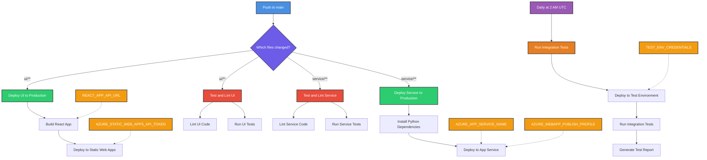

# StatFoundry

The quickest and simplest way to find any stat you can think of.

## Project Structure

```
StatFoundry/
├── service/           # FastAPI backend
│   ├── app/          # Application code
│   ├── tests/        # Backend tests
│   ├── requirements.txt
│   └── .python-version
├── ui/               # React frontend
│   ├── src/         # Source code
│   ├── tests/       # Frontend tests
│   └── package.json
├── docs/            # Documentation
│   └── assets/      # Documentation assets
└── .github/         # GitHub workflows
```

## Graph Architecture

The core graph schema is visualized in [docs/assets/graph_schema.mmd](docs/assets/graph_schema.mmd). The architecture lies across two axes:

### Temporal Axis: Plays to Seasons

`(Play)-[:OF]->(Drive)-[:OF]->(Game)-[:OF]->(Week)-[:OF]->(Season)`

### Organizational Axis: Players to Teams

`(Player)-[:MADE]->(PlayerPlay)-[:OF]->(Play)`
`(Team)-[:MADE]->(TeamPlay)-[:OF]->(Play)`

In certain places, these axes converge, creating a compound node. These are essentially lenses to view events from different perspectives.

`(Entity)-[:HAD]->(CompoundNode)-[:OF]->(TemporalNode)`

`(Player)-[:HAD]->(PlayerGame)-[:OF]->(Game)`

`(Team)-[:HAD]->(TeamGame)-[:OF]->(Game)`

etc...

### Relationships: There are 2 relationship types in this design

`HAD` is used when an Entity has a CompoundNode (e.g., Player had a PlayerGame)

`OF` represents a continuation along one of the defined axes. Essentiall aggregating up to the whole.

This pattern of scales nicely within the realm of American Football, as we can add college and USFL pretty easily with this pattern. We can also add things like coaches, coaching trees, officials, officiating crews, broadcasters. Think, maybe we can quantify the broadcaster's jinx, via analyzing `(BroadcastPlay)-[OF]->(NFLPlay)`

The pattern also seems to scale well outside of most organized sports, where teams are divided into divisions which make up leagues consisting of a collection games

## Design Considerations

While a graph database might seem like overkill for the current data model which follows fairly rigid hierarchical relationships, the choice was made with future extensibility in mind. The real power of the graph model will emerge as we add:

- Historical relationships (player transfers between teams, coaching changes)
- Complex interconnections (player-to-player interactions, teammate history)
- Multi-dimensional analysis (broadcast crews, weather conditions, stadium data)
- Cross-league relationships (college to NFL transitions, USFL/XFL crossovers)
- Social/influence networks (coaching trees, player mentorships)

These additions will create a rich web of relationships that would be challenging to model and query efficiently in a traditional relational database. The graph structure will allow us to:

1. Discover hidden patterns and relationships
2. Perform complex path-finding queries
3. Analyze network effects and influence
4. Scale horizontally as new relationship types are added

The initial investment in graph architecture positions us well for these future enhancements while maintaining a clean and intuitive data model for the current scope.

## Development Setup

### Prerequisites
- Node.js 16+ (for frontend)
- Python 3.11+ (for backend)
- Neo4j AuraDB instance

### Python Environment

```bash
# Install pyenv (if not already installed)
brew install pyenv

# Install Python version
pyenv install 3.11.0

# Create and activate virtual environment
cd service
pyenv local 3.11.0
python -m venv .venv
source .venv/bin/activate

# Install dependencies
pip install -r requirements.txt

# Set environment variables:
# ENVIRONMENT=development (for local dev)
# NEO4J_STATFOUNDRY_NFL_AURA_URI=your-neo4j-uri
# NEO4J_STATFOUNDRY_NFL_AURA_PASSWORD=your-password

# Start the backend
uvicorn src.app:app --reload
```

### Frontend Setup

```bash
cd ui
npm install
cp .env.example .env
# Configure environment variables in .env for local development
npm start
```

## Deployment

### Environment Configuration

#### Development
- **Frontend**: `http://localhost:3000` → `http://localhost:8000`
- **Backend**: CORS enabled for local development
- **Database**: Neo4j AuraDB
- **Environment Variables**: Uses `.env` files and local environment

#### Production
- **Frontend**: Azure Static Web Apps
- **Backend**: Azure App Service
- **Database**: Neo4j AuraDB with production credentials
- **Security**: CORS disabled, environment-based configuration

### Automated Deployments

#### Frontend (Azure Static Web Apps)
- **Trigger**: Pushes to `main` branch with changes in `ui/` directory
- **Process**: Build React app with production environment → Deploy to Azure Static Web Apps
- **Configuration**: Uses `.env.production` for environment variables
- **Requirements**:
  - `AZURE_STATIC_WEB_APPS_API_TOKEN` repository secret
  - Environment variables set in workflow (production service URL)

#### Backend (Azure App Service)
- **Trigger**: Pushes to `main` branch with changes in `service/` directory
- **Process**: Build Python app → Deploy to Azure App Service
- **Configuration**: Environment variables set in Azure App Service
- **Requirements**:
  - Azure service principal secrets for authentication
  - Production environment variables in Azure App Service:
    ```
    ENVIRONMENT=production
    NEO4J_STATFOUNDRY_NFL_AURA_URI=your-neo4j-uri
    NEO4J_STATFOUNDRY_NFL_AURA_PASSWORD=your-password
    ```

### Security Features

- **Environment-based CORS**: Backend CORS middleware only enabled in development
- **Environment variable validation**: Backend validates required environment variables on startup
- **Separate configurations**: Different environment files for development vs production
- **Secure deployment**: Production deployments use Azure service principals and deployment tokens

## CI/CD Workflows



### Workflow Legend

- 🔵 Blue: Trigger events
- 🟣 Purple: Decision points
- 🟢 Green: Deployment steps
- 🔴 Red: Testing steps
- 🟠 Orange: Secrets
- 🟡 Yellow: Scheduled events

### Workflow Descriptions

#### Test and Lint UI

- Runs only when UI files change
- Lints React/TypeScript code
- Runs UI unit and integration tests
- No secrets required

#### Test and Lint Service

- Runs only when service files change
- Lints Python code
- Runs service unit and integration tests
- No secrets required

#### Deploy UI to Production

- Runs only when UI files change
- Builds the React application
- Deploys to Azure Static Web Apps
- Required secrets:
  - `AZURE_STATIC_WEB_APPS_API_TOKEN`: For Azure Static Web Apps deployment
  - `REACT_APP_API_URL`: The URL of your FastAPI service

#### Deploy Service to Production

- Runs only when service files change
- Installs Python dependencies
- Deploys to Azure App Service
- Required secrets:
  - `AZURE_APP_SERVICE_NAME`: Name of your Azure App Service
  - `AZURE_WEBAPP_PUBLISH_PROFILE`: Publish profile from Azure App Service

#### Nightly Integration Tests

- Runs automatically at 2 AM UTC daily
- Deploys latest code to a test environment
- Runs end-to-end integration tests between UI and service
- Generates and stores test reports
- Required secrets:
  - `TEST_ENV_CREDENTIALS`: Credentials for the test environment deployment

## Contributing

1. Create a feature branch
2. Make your changes
3. Submit a pull request

## License

MIT

# Data Ingestion & ETL

## Overview

StatFoundry ingests NFL data directly from [nflverse](https://github.com/nflverse/nflverse-data) CSV sources into Neo4j using Cypher `LOAD CSV` statements. The ETL process creates a graph structure that models the hierarchical relationships between players, teams, games, and statistics.

## ETL Scripts

All ETL scripts are located in `service/scripts/etl/cypher/` and are designed to be idempotent (safe to run multiple times).

### 1. Load Players (`load_players.py`)

**Purpose:** Creates Player nodes with biographical and career information

**Data Source:** `https://github.com/nflverse/nflverse-data/releases/download/players/players.csv`

**Key Features:**
- Creates unique constraint on `gsis_id` (NFL's Global System ID)
- Loads all players with `rookie_season = 2025`
- Includes position, college, draft info, physical attributes
- Sets properties: `name`, `position`, `college_name`, `rookie_year`, etc.

**Node Created:** `Player {gsis_id: "00-0034857", name: "Josh Allen", ...}`

### 2. Load Games (`load_games.py`)

**Purpose:** Creates Game nodes for NFL games

**Data Source:** `https://github.com/nflverse/nflverse-data/releases/download/schedules/schedules.csv`

**Key Features:**
- Creates unique constraint on `game_id` (format: `2025_01_ARI_BUF`)
- Loads 2025 season games
- Includes scores, location, weather, betting lines
- Creates relationships: `(Game)-[:OF]->(Week)-[:OF]->(Season)`

**Node Created:** `Game {game_id: "2025_01_ARI_BUF", home_team: "BUF", away_team: "ARI", ...}`

### 3. Load PlayerGames (`load_playergames.py`)

**Purpose:** Creates PlayerGame nodes linking players to their game statistics

**Data Source:** `https://github.com/nflverse/nflverse-data/releases/download/stats_player/stats_player_week_2025.csv`

**Key Features:**
- Creates unique constraint on `(player_id, game_id)` combination
- Matches players using `gsis_id` (requires Players loaded first)
- Matches games using season/week/teams (requires Games loaded first)
- Includes passing, rushing, receiving, defensive stats
- Creates relationships: `(Player)-[:HAD]->(PlayerGame)-[:OF]->(Game)`

**Node Created:** `PlayerGame {player_game_id: "00-0034857_2025_01_ARI_BUF", passing_yards: 320.0, ...}`

**Dependencies:** Must run **after** `load_players.py` and `load_games.py`

### 4. Load TeamGames (`load_teamgames.py`)

**Purpose:** Creates TeamGame nodes with team-level game statistics

**Data Source:** `https://github.com/nflverse/nflverse-data/releases/download/team_stats/team_stats.csv`

**Key Features:**
- Creates unique constraint on `(team_abbr, game_id)` combination
- Aggregated team statistics (total passing yards, rushing yards, etc.)
- Creates relationships: `(Team)-[:HAD]->(TeamGame)-[:OF]->(Game)`

**Node Created:** `TeamGame {team_game_id: "BUF_2025_01_ARI_BUF", total_passing_yards: 450, ...}`

## Load Order & Dependencies

**Critical:** Scripts must be run in this order due to relationship dependencies:

```
1. load_players.py     (no dependencies)
2. load_games.py       (no dependencies)
3. load_playergames.py (requires Players + Games)
4. load_teamgames.py   (requires Games)
```

**Why order matters:**
- `load_playergames.py` uses `MATCH (p:Player {gsis_id: ...})` to find existing players
- If Players aren't loaded first, PlayerGame creation will fail
- All game-related scripts need Game nodes to exist for `[:OF]` relationships

## Running ETL Scripts

### Manual Execution

```bash
cd service
source .venv/bin/activate

# Set environment variables
export NEO4J_STATFOUNDRY_NFL_AURA_URI=your-neo4j-uri
export NEO4J_STATFOUNDRY_NFL_AURA_PASSWORD=your-password

# Run in order
python scripts/etl/cypher/load_players.py
python scripts/etl/cypher/load_games.py
python scripts/etl/cypher/load_playergames.py
python scripts/etl/cypher/load_teamgames.py
```

### Automated Ingestion

ETL scripts run automatically via GitHub Actions workflow (`.github/workflows/data-ingestion.yml`):

**Trigger:** Scheduled to run weekly (or manual dispatch)

**Process:**
1. Sets up Python environment
2. Installs dependencies from `requirements.txt`
3. Runs all four ETL scripts in correct order
4. Reports success/failure status

**Environment Variables:** Neo4j credentials stored as GitHub secrets

## Graph Schema Created

The ETL process creates this graph structure:

```
(Player)-[:HAD]->(PlayerGame)-[:OF]->(Game)
(Team)-[:HAD]->(TeamGame)-[:OF]->(Game)
(Game)-[:OF]->(Week)-[:OF]->(Season)
```

See [docs/assets/graph_schema.mmd](docs/assets/graph_schema.mmd) for complete schema visualization.

## Data Sources

All data comes from [nflverse-data](https://github.com/nflverse/nflverse-data), a community-maintained repository of NFL data:

- **Players:** Biographical info, draft data, positions
- **Schedules:** Game information, scores, locations
- **Player Stats:** Weekly statistics for all players
- **Team Stats:** Aggregated team-level game statistics

## Future Enhancements

- [ ] Add PlayerDrive and Drive nodes for drive-level analysis
- [ ] Add PlayerPlay and Play nodes for play-by-play analysis
- [ ] Implement incremental updates (only load new weeks)
- [ ] Add data validation and quality checks
- [ ] Create summary/materialized views for common queries
